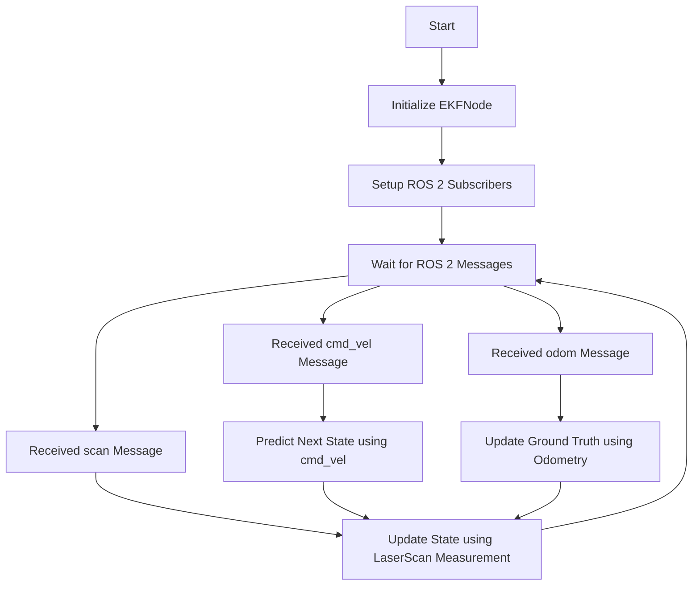

# ROS 2 RCLPY EKF Localization 

## Content

```shell
├── config
│   ├── landmarks.yaml   # file containg GT positions of landmarks. Used to spawn landmarks in gazebo and pass info to ekf nodes.
│   └── rviz.rviz        # rviz configuration
├── ekf_localization 
    ├── ekf_localization_with_known_correspondences.py         # Implementation of EKF localization with known correspondences 
    ├── ekf_localization_with_unknown_correspondences.py       # Implementation of EKF localization with unkown correspondeces
    ├── ekf_localization_with_unknown_correspondences_mht.py   # ?
    ├── ekf_localization_with_unknown_correspondences_mht2.py  # Implementation of Multiple Hypothesis Tracking EKF localization with unkown correspondences
    ├── __init__.py
    ├── landmark_spawner.py   # Utility node that spawns the landmarks inside gazebo
    └── utils
        ├── ekf.py      # Implements basic ekf with prediction (based on diff drive velocity motion model) and measurement (based on 2d range and bearing from Laserscanner measurement function). Base class to inherit from
        ├── helpers.py  # Helper functions (math, plotting)
        └── __init__.py
```

## Usage

- `ros2 launch ekf_localization simulation.launch.py`
- `ros2 run ekf_localization ekf_localization_with_known_correspondences` # Works fine

## [EKF](./ekf_localization/utils/ekf.py)


Is an implementation of the Extended Kalman Filter (EKF) for localization using ROS 2.   
__This is not a fully working class but a class that should be used to derive from!__

### High-Level Overview

1. **EKF Node**: 
    - The main class `EKF` is derived from `Node`, which is a fundamental ROS 2 class.
    - The class initializes various parameters and configurations for the EKF algorithm, including:
        - Initial state $\mu$ and covariance $\Sigma$
        - Process and measurement noise $P$ respectively $Q$
        - Landmarks' positions (provided from [landmarks.yaml](./config/landmarks.yaml))
        - Parameters for data association and maximum allowed distance for association
    - The node listens to LaserScan messages (typically from a LIDAR sensor) and uses them to update the robot's position.
    - EKF localization works in a predict-update cycle. In the prediction step, the robot's motion model predicts its new position. In the update step, measurements from sensors are used to correct this prediction. The key methods for these steps are `predict` and `update`.

2. **Localization Functions**: 
    - The `predict` method takes in the current state and control inputs, and returns a predicted state and covariance based on the robot's motion model.
    - The `update` method takes in the current state, covariance, and a new measurement, and returns an updated state and covariance.
    - Helper functions are used to compute the expected measurement (`measurement_function`), the Jacobian of the measurement function (`jacobian_of_measurement`), and the data association (`data_association`).
    - Note: The file seems to be truncated, so there might be more functionalities at the end.


### Detailed Explanation

1. **Initialization (`__init__`)**:
    - The node is initialized with a given `node_name` and various parameters such as initial state, covariance, process noise, measurement noise, and more.
    - If unknown correspondences are used, a parameter for the data association method is declared. 
    - The initial state and covariance are set using the provided parameters or their defaults. 
    - The process noise and measurement noise matrices are created.
    - Landmarks are loaded from a provided file using the `load_landmarks` function.

2. **Prediction (`predict`)**:
    - This method updates the robot's state based on the given control input (robot's motion). 
    - The state transition function is applied, and the Jacobian of the motion model is calculated.
    - The state and covariance are updated based on the motion model and the process noise.

3. **Expected Measurement Calculation (`measurement_function`)**:
    - Given a robot's state and a landmark's position, this function computes the expected measurement (range and bearing) from the robot to the landmark.
    - It calculates the difference in x and y coordinates between the robot's state and the landmark, determines the range using the Pythagorean theorem, and calculates the bearing using the arctangent function.

4. **Jacobian of Measurement (`jacobian_of_measurement`)**:
    - Given the robot's state and a landmark's position, this function calculates the Jacobian of the measurement function with respect to the state.
    - It computes the differences in the x and y coordinates, calculates the squared distance, and then forms the Jacobian matrix based on these values.

5. **Update (`update`)**:
    - This method performs the correction step of the EKF. Given the robot's state, covariance, a new measurement, the measurement noise, and a landmark's position, it updates the state and covariance.
    - The expected measurement is first calculated using the `measurement_function`.
    - The measurement residual (difference between the actual and expected measurements) is computed.
    - The Jacobian of the measurement function is calculated.
    - The Kalman gain is computed using the Jacobian, covariance, and measurement noise.
    - The state and covariance are then updated using the Kalman gain and the measurement residual. The angle in the state is normalized to be within \([- \pi, \pi]\).
    - Joseph's form is used to update the covariance as it's numerically more stable.

---


## [EKF Localization With Known Correspondences](./ekf_localization/ekf_localization_with_known_correspondences.py)

The code defines an `EKFNode` class that inherits from the `EKF` class (from `ekf.py`) for localization with known correspondences.


1. **Subscribers**: 
    - `/cmd_vel` [geometry_mgs/msg/Twist] - used to predict the robots' state based on differential drive velocity motion model
    - `/scan` [sensor_msgs/msg/Twist] - used to extract observations, in terms of range and bearing to landmarks, 
    - `/odom` for ground truth odometry



## Low-Level Detailed Explanation

1. **Initialization (`__init__`)**:
    - The node is initialized and super's (EKF from `ekf.py`) initialization is called with the landmark file and known correspondences set to `True`.
    - ROS 2 subscribers are set up for `/cmd_vel`, `/scan`, and `/odom` topics. These subscribers listen to `Twist`, `LaserScan`, and `Odometry` messages respectively.
    - Lists for storing state and odometry data for plotting are initialized. 
    - A matplotlib plot is set up for visualization.

2. **Command Velocity Callback (`cmd_vel_callback`)**:
    - This function is triggered when a `cmd_vel` message is received.
    - It predicts the next state using the motion command from the message.
    - The process noise is updated based on the motion.
    - Using the inherited `predict` method from `EKF`, the state and covariance are predicted.

3. **LaserScan Callback (`laser_callback`)**:
    - Triggered when a `LaserScan` message is received.
    - It calculates the observed landmarks from the laser scan data.
    - It updates the robot's state using the observed measurements.
    - The inherited `update` method from `EKF` is used to update the state and covariance based on the laser measurements.
    - Visualization functions are called to plot the robot's state, landmarks, and measurements.

4. **Odometry Callback (`odom_callback`)**:
    - Triggered when an `Odometry` message is received.
    - It updates the ground truth for plotting purposes and observation matchin.

